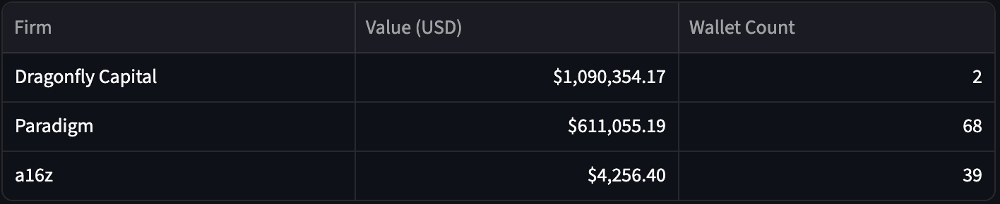

# On-Chain VC Intelligence Dashboard

[](https://[YOUR-APP-URL-HERE].streamlit.app)

A real-time, interactive dashboard for tracking and analyzing the on-chain portfolio movements of top-tier crypto venture capital firms on Ethereum, built with Python and Streamlit.

---

## 📸 Key Features

*   📊 **VC Leaderboard:** A macro-level overview comparing the total on-chain value and wallet count of all tracked VC firms.
*   🔍 **Single-Fund Deep Dive:** Select a specific VC to see an aggregated view of their total holdings and a detailed breakdown of each individual wallet.
*   📈 **Live Portfolio Analysis:** An on-demand token-level analysis for any available VC, complete with an interactive pie chart visualizing their asset allocation.
*   ⚡ **Real-Time Activity Feed:** A value-enriched feed of recent token transfers for any high-value wallet, allowing for the immediate identification of significant capital flows.
*   🕸️ **Interactive Network Visualizer:** An interactive color-coded "mind map" that visualizes the relationships and transaction flows between a VC wallet and its counterparties.

## 💡 Strategic Rationale

The operations of VC are being reshaped by the inherent transparency of public blockchains. This project was built taking advantage of this feature.

The dashboard moves beyond news reports to focus on "ground truth" data recorded on the blockchain. By sourcing wallets from community-curated Dune Analytics data and enriching it in real-time with Covalent and Etherscan APIs, this tool can surface a VC's seed investments as they happen, monitor their portfolio allocations, and analyze their on-chain strategies with clarity.

## 🛠️ Stack & Architecture

*   **Data Sourcing:** Dune Analytics (via Dune API)
*   **On-Chain Data:** Covalent API, Etherscan API
*   **Backend & Data Processing:** Python, Pandas
*   **Frontend & Visualization:** Streamlit, Plotly, PyVis, NetworkX
*   **Deployment:** Streamlit Community Cloud

## 🖼️ Gallery

*Example pngs from the app:*

**VC Leaderboard**



**Paradigm Pie Chart**


**a16z Wallet Transactions**


## 🚀 Setup & Local Installation

1.  **Clone the repository:**
    ```bash
    git clone https://github.com/MinterGMT/vc-dashboard.git
    cd vc-dashboard
    ```
2.  **Create and activate a virtual environment:**
    ```bash
    python -m venv venv
    source venv/bin/activate
    ```
3.  **Install dependencies:**
    ```bash
    pip install -r requirements.txt
    ```
4.  **Set up environment variables:**
    Create a `.env` file in the root directory and add your own free API keys:
    ```
    DUNE_API_KEY="..."
    COVALENT_API_KEY="..."
    ETHERSCAN_API_KEY="..."
    ```
5.  **Run the app:**
    ```bash
    streamlit run app.py
    ```

## 🧠 Key Learnings & Engineering Decisions

This project was a deep dive into the real-world challenges of on-chain analysis. Key engineering pivots included:

*   **Data Source:** The initial plan to use proprietary APIs from Arkham/Nansen was found to be unfeasible due to access limitations. The project was successfully re-architected with the more robust, open stack built on Dune, Covalent, and Etherscan.
*   **Performance over Precision:** The "Recent Activity Feed" feature initially attempted to fetch historical prices for every transaction. Rigorous testing proved this to be unacceptably slow and unreliable. The final version uses a "Current Portfolio Price Map" strategy, a critical product trade-off that delivers 95% of the analytical value at 1000% of the speed, allowing for a better user experience.
*   **The P&L Engine:** A P&L feature was successfully built to trace an asset's acquisition cost. However, it also revealed the fundamental limitations of public data for early-stage tokens, where historical prices are often unavailable. The "None" values in the final output are not a bug, but an accurate reflection of this on-chain reality, leading to a strategic decision to keep the feature as an optional "deep analysis" rather than a default view.# vc-dashboard
